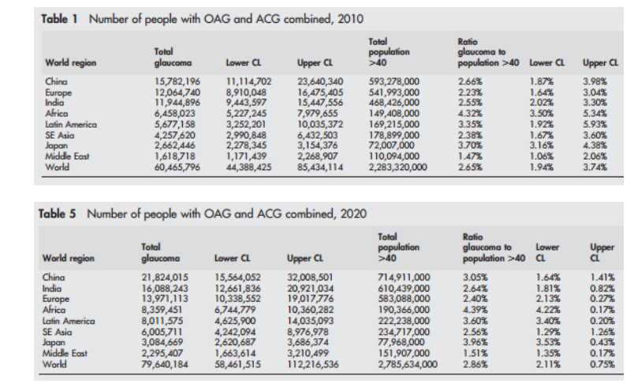
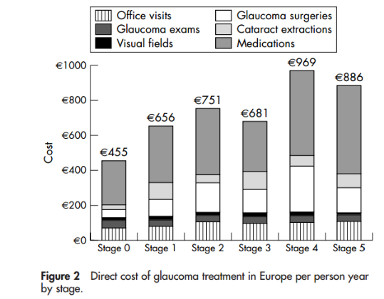
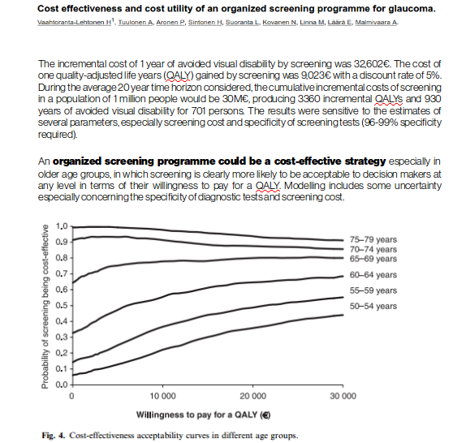

# Cost-effective glaucoma screening

Very hard to make glaucoma screening for **pre-perimetric** glaucoma cost-effective even with risk stratified screening targeting pre-known risk groups? How about **later stages**? Would it make more sense to target **disease progression** at home from health economics perspective?

## Simulation Init (R)

You can try to build on this

*TODO! Need to tweak the plot and correct the axes!*

So to establish first what are the True Positive, False Positive, False Negative, True Negative rates depending on our device specificity, glaucoma prevalence, and clinician variability in glaucoma diagnosis

## Quick References

* Basic **Bayesian stats** intro: http://sphweb.bumc.bu.edu/otlt/MPH-Modules/BS/BS704_Probability/BS704_Probability6.html
* **Bayesian vs. Frequentist Holy War**: http://jakevdp.github.io/blog/2014/03/11/frequentism-and-bayesianism-a-practical-intro/

## Introduction

Rough estimates how good the device should be, and how does this translate to real-life performance. Then that should be **linked to cost-estimates** of False Positives (what is the cost of **over-referral**) and False Negatives (what is the cost of **not detecting glaucoma**).

And of course then you need try to estimate what is the **cost saving of picking up glaucoma early** (or at stage I compared to later stages for examples), or added cost. And then what is your average **disease trajectory**, if you can keep your patient at Stage I with costly or inexpensive medication, would that be cheaper than **letting the patient deteriorate to Stage II** and having to start costlier treatment there? 

And then you need some meaningful estimate of the **[QALY](https://en.wikipedia.org/wiki/Quality-adjusted_life_year)**, and are **people interested** actually about their eye health? Do they **adhere** to the medication even?

*featuring [Capsule](https://www.capsulecares.com/) and [Round Refill](https://roundhealth.co/) from [Circadian Design](https://medium.com/circadian-design)*

And finally you can always remember the cynical "truth" that **[Dead Patient is a Cheap Patient](https://www.youtube.com/watch?v=1m0vCOikrcU)**, and in most cases the early intervention does not lead to reduced burden (Resource, and Moneywise) of the healthcare system

And who will actually push against if you could cure patients, or with early intervention to glaucoma kill all the subsequent **revenue from patients**. Is that a sustainable business model, where are the famous **recurring revenues** in this scenario?

https://www.cnbc.com/2018/04/11/goldman-asks-is-curing-patients-a-sustainable-business-model.html

Everything becomes even more uncertain when your actual "ground truth" diagnosis labels are off. Play with the [table](tables/ROC_table.ods) if you like, but the analysis/simulation is done in R.

* For **clinician performances**, See e.g. Reus et al. (2010), https://doi.org/10.1016/j.ophtha.2009.09.026, Hadwin et al. (2013), http://dx.doi.org/10.1111/opo.12066, Scheetz et al. (2015), http://dx.doi.org/10.1111/ijcp.12600

## Health Statistics

See for example the lecture by Katherine Payne from Manchester Centre for Health Economics (MCHE)

Economic Evaluation | https://youtu.be/rtgxib3glsI?t=14m46s

Methods of economic evaluation | https://youtu.be/rtgxib3glsI?t=22m46s

The cost-effectiveness plane | https://youtu.be/rtgxib3glsI?t=32m46s

Willingness to pay (WTP) | https://youtu.be/rtgxib3glsI?t=37m33s

## Glaucoma Statistics

Some statistics from papers giving you guidelines where to start your journey in the world of glaucoma health economics. Some estimates of the **glaucoma prevalence**, **direct costs per disease stage**, and **indirect societal costs** due to lost productivity.

The cynical take again would be that for hospitals and insurance providers (especially in a system like USA where **[patients do not know what things cost](http://doi.org/10.1001/jama.2016.4325))** it might be profitable to **have sick patients** coming to your business as illustrated with the case [where surgery complications where found to be the most profitable business](https://www.nytimes.com/2013/04/17/health/hospitals-profit-from-surgical-errors-study-finds.html).

[}(https://www.nytimes.com/2013/04/17/health/hospitals-profit-from-surgical-errors-study-finds.html)

If government (i.e. tax-payers) pay the bill, there is an actual system-level incentive to reduce both direct healthcare costs, and indirect costs as the too sick patients cannot work, pay taxes and execute. One could generalize that healthcare incentives are distorted.

**Slide 62 from [[AI in Ophthalmology | Startup Landscape]](https://www.slideshare.net/PetteriTeikariPhD/artificial-intelligence-in-ophthalmology)

One way to achieve **[price transparency](https://www.nytimes.com/2016/12/19/upshot/price-transparency-is-nice-just-dont-expect-it-to-cut-health-costs.html)** in the US healthcare system could be the introduction of "$5,000 health stamps" (see e.g. [Dinesh D'Souza's answer](https://www.youtube.com/watch?v=uOuLQXnbd5s)), where the patients would be spending their own money for routine healthcare (which of course could have unintended consequences)

### Vision Loss

From [Bourne et al. (2017)](http://dx.doi.org/10.1136/bjophthalmol-2017-311258):

### Glaucoma Prevalence and projections

[Quigley and Broman (2010)](http://doi.org/10.1136/bjo.2005.081224)
[Cited by 3,677 articles](https://scholar.google.co.uk/scholar?cites=3913844328440524411&as_sdt=2005&sciodt=0,5&hl=en)

See also [Tham et al. (2014)](http://dx.doi.org/10.1016/j.ophtha.2014.05.013) for projections, and [Chan et al. (2014)](http://dx.doi.org/10.1136/bjophthalmol-2014-306102) for more Asia-specific statistics (from SERI)

From [Burr et al. (2007)](http://researchonline.lshtm.ac.uk/8383/):

### Stage-wise costs

[Lee et al. (2006)](http://dx.doi.org/10.1001/archopht.124.1.12)

[Traverso et al. (2005)](http://dx.doi.org/10.1136/bjo.2005.067355)

**Willingness to pay for QALY in Finland**

[Vaahtoranta-Lehtonen et al. (2007)](https://doi.org/10.1111/j.1600-0420.2007.00947.x) (**[cited by 66 articles](https://scholar.google.co.uk/scholar?cites=8938518617503454586&as_sdt=2005&sciodt=0,5&hl=en)**)

**Especially in Singapore**

See studies by 
* [Seang-Mei et al. 2005](https://www.ncbi.nlm.nih.gov/pubmed/16276277) | [cited by 34 articles](https://scholar.google.co.uk/scholar?cites=7546155073406021974&as_sdt=2005&sciodt=0,5&hl=en)
* [Wang and Chew (2004)](http://dx.doi.org/10.1111/j.1442-9071.2004.00906.x) | [cited by 21 articles](https://scholar.google.co.uk/scholar?cites=171586620128783280&as_sdt=2005&sciodt=0,5&hl=en), 
* [Lim et al. (2016)](https://doi.org/10.1097/IJG.0000000000000393) | [cited by 9 articles](https://scholar.google.co.uk/scholar?cites=6257751590156299834&as_sdt=2005&sciodt=0,5&hl=en)

#### Scheetz et al. (2016) Review

[Scheetz et al. 2016](http://dx.doi.org/10.1111/ijcp.12600): 

*The burden of glaucoma **increases as disease severity worsens**; especially the financial burden. In the USA, there is a fourfold increase in average direct costs per patient (pp), with the earliest stage of glaucoma costing US $623pp and end stage glaucoma/blindness costing US $2511pp (Lee et al. 2006). There have been similar findings in Europe with early stages of glaucoma having direct costs of US $588pp and end stage costing US $1253 per person per year (Traverso et al. 2005).*

*The **indirect costs** of glaucoma can be difficult to quantify. In Australia, the prevalence of POAG in 2005 was 208,000 and is expected to rise to 379,000 by 2025 (Dirani et al. 2011). This increase will see the total estimated costs of treating those with POAG (healthcare costs, indirect costs such as **loss of productivity** and loss of well-being measured as disability adjusted life years rise from US $1.77 billion in 2005 to US $4.01 billion in 2025 (Dirani et al. 2011).*

*A **European** study by Poulsen estimates the average cost per person for community services (including equipment, residential care, household and guide dogs) to be US $7885 and patient and family (household and transportation) to be US $11,149 annually (Poulsen et al. 2005).*

### Biomarkers

#### Visual Field

From [Boodhna et al. 2017](http://openaccess.city.ac.uk/17931/)

From [Bryan and Crabb (2018)](http://doi.org/10.1167/tvst.7.1.22), new way to visualize (Hedgehog Plot):

 
*(A) Hedgehog Plot showing rate of VF progression status in a **sample of 200 eyes from 100 patients**. (B) All eyes are colored depending on the rate of progression. This can be divided into (C) eyes that are stable/improving (slope > 0 dB/y), (D) eyes with slow progression (−0.5 < slope < 0 dB/y), (E) eyes with moderate progressoion (−1 < slope < −0.5 dB/y), and (F) eyes with fast progression (−1 < slope).*

##### Deep Learning

[Wen et al. (2018)](https://doi.org/10.1101/293621): To determine if deep learning networks could be trained to **forecast a future** 24-2 Humphrey Visual Field (HVF). More than 1.7 million perimetry points were extracted to the hundredth decibel from **32,443 24-2 HVFs**. Conclusions: Using unfiltered **real-world datasets**, deep learning networks show an impressive ability to not only learn spatio-temporal HVF changes but also to **generate predictions for future HVFs up to 5.5 years**, given only a single HVF. 

#### IOP:

*Intraocular pressure (IOP). G, glaucoma population; N, normal distribution; P, frequency of distribution of IOP in population.*

#### Optic disc screening performance:

##### Deep Learning

We retrospectively included 48 116 fundus photographs for the development and validation of a deep learning algorithm. In the validation dataset, this deep learning system achieved an **AUC of 0.986** with sensitivity of 95.6% and specificity of 92.0%. The most common reasons for **false-negative** grading (n = 87) were GON with coexisting eye conditions (n = 44 [50.6%]), including pathologic or high myopia (n = 37 [42.6%]), diabetic retinopathy (n = 4 [4.6%]), and age-related macular degeneration (n = 3 [3.4%]). The leading reason for **false-positive** results (n = 480) was having other eye conditions (n = 458 [95.4%]), mainly including physiologic cupping (n = 267 [55.6%]). Misclassification as **false-positive** results amidst a normal-appearing fundus occurred in only 22 eyes (4.6%).

#### OCT RNFL thickness

#### Structural vs. Functional tests

##### RFNL + Visual Field

[Garway-Heath et al. (2018)](https://dx.doi.org/10.3310%2Fhta22040): OBJECTIVE: To compare statistical methods that **combine VF and OCT data** with VF-only methods to establish whether or not these allow (1) more rapid identification of glaucoma progression and (2) shorter or smaller clinical trials.

*The sANSWERS method combining VF and OCT data had a **higher hit rate** and **identified progression more quickly** than the reference (Guided Progression Analysis™ (GPA) Software, Carl Zeiss) and other VF-only methods, and produced more accurate estimates of the progression rate, but did not increase treatment effect statistical significance. Similar studies with current OCT technology need to be undertaken and the statistical methods need refinement.*

#### Comparison

From [Burr et al. (2007)](http://researchonline.lshtm.ac.uk/8383/):

## Screening and Patient Journey

From [GLAUCOMA PREFERRED PRACTICE PATTERN® DEVELOPMENT PROCESS AND PARTICIPANTS](https://pdfs.semanticscholar.org/0c9d/fcbd1f2ccad3a77c74b818da397767fb7cb4.pdf):

*Screening for glaucoma in the general population is **not cost-effective** ([Burr et al. 2007](http://researchonline.lshtm.ac.uk/8383/), [Hernandez et al. 2008](https://doi.org/10.1017/S0266462308080288)). Screening is more useful and cost-effective when it is **targeted at population**s at high risk for glaucoma, such as older adults[Friedman et al. 2004](https://doi.org/10.1001/archopht.122.4.532), those with a family history of glaucoma and African Americans and Hispanics [Doshi et al. 2008 | "The Los Angeles Latino Eye Study
"](https://doi.org/10.1016/j.ophtha.2007.05.032). **Primary open-angle glaucoma** may be an ideal disease to detect by screening because it is often asymptomatic until late in the disease process, it creates significant morbidity, and treatment slows or prevents the progression of visual field loss.

From [Burr et al. (2007)](http://researchonline.lshtm.ac.uk/8383/):

Markov model for disease progression From [Burr et al. (2007)](http://researchonline.lshtm.ac.uk/8383/):

### Teleophthalmology

[Myers et al. (2018)](http://doi.org/10.1111/ceo.13138):

*"...Newer technology continues to contribute to teleophthalmology efforts, but barriers remain to widespread adoption. [Rathi et al. 2017](https://doi.org/10.1016/j.ophtha.2017.05.026https://doi.org/10.1016/j.ophtha.2017.05.026) However, the Scottish Eyecare Integration project was able to utilize teleophthalmology to reduce wait times and make final diagnosis in 20% of cases without direct consultation. [Jeganathan et al. 2017](https://dx.doi.org/10.22608/APO.2016110) In a test of teleophthalmology involving clinical data as well as imaging, virtual review was only found to differ from face-to-face consultation in 3.4% of 204 cases. [Clarke et al. 2017](http://dx.doi.org/10.1136/bjophthalmol-2016-308993)"*

"Automated optic nerve analysis has captured the attention of many researchers and significant advances have been made. Although promising approaches have been proposed, each methodology has its limitations. Low image resolution has also been cited as a limiting factor. [Fraz et al. 2012](https://doi.org/10.1016/j.cmpb.2012.03.009) Fundus cameras capable of high-resolution images will further facilitate efforts in automated glaucoma screening. In its current state, automated glaucoma screening systems do not replace, but at best complement the work of glaucoma specialists. Further research is required and a combination of methods will likely be necessary for accurate optic nerve head analysis."

## Modeling background

* Burr et al. (2007), https://dx.doi.org/10.3310/hta11410, Screening in UK for Glaucoma, NHS Setting
* Moyer (2013), https://dx.doi.org/10.7326/0003-4819-159-6-201309170-00686, ISA
* Tuulonen (2017), https://dx.doi.org/10.4103/0301-4738.73684
* Anton et al. (2017), https://dx.doi.org/10.2147/OPTH.S120398
* Estimate of needed duration and number of subjects by Steve Kymes needed for proper health economical study for glaucoma screening program. Presented by John Boland at “Should we screen for glaucoma?” session at [World Glaucoma Congress 2017](http://www.worldglaucoma.org/WGC/WGC2017/program/courses/) in Helsinki, Finland.

### Risk Stratification 

* Zhao et al. (2017), https://doi.org/10.1016/j.ajo.2017.05.017
* Ross et al. (2017), https://doi.org/10.1109/TMI.2016.2608782
* Alaa et al. (2017), https://arxiv.org/abs/1705.07674
* Zalewski et al. (2017), https://doi.org/10.1109/BHI.2017.7897302
* Hussein et al. (2017), https://arxiv.org/abs/1704.08797

* “Overview of ethnicity and race” by M. Roy Wilson (United States) at Risk Profiling symposium at World Glaucoma Congress 2017, Helsinki, Finland, http://www.worldglaucoma.org/WGC/WGC2017/author/wilson_m-roy
* SERI PAPER, about in Singapore, http://dx.doi.org/10.1001/jamaophthalmol.2015.1478 -> cited by [13 articles](https://scholar.google.co.uk/scholar?cites=16992672648175795977&as_sdt=2005&sciodt=0,5&hl=en)
* Crowston and Trounce, 2017, http://dx.doi.org/10.1126/science.aam7935

### Cost-effectiveness papers

#### Kymes et al. (2006): Management of ocular hypertension: a cost-effectiveness approach from the Ocular Hypertension
https://doi.org/10.1016/j.ajo.2006.01.019 | http://bolandlab.wilmer.jhu.edu/refs/PMID/16765666.pdf

For the **treatment of ocular hypertension** (not *screening*): 

*"**Utility** loss because of POAG was particularly influential in our analyses. Utility loss is a measurement of the impact
of POAG on quality of life because of the loss of visual. Some **clinicians have questioned** whether a nonfatal disease with **modest early impact on functional status** should be considered to have a significant impact on quality of life. [9] The model was most sensitive to the utility loss that is experienced in stage 1 of the disease, where we assumed the utility loss was small (that is, 0.026)"*

*"At present, published risk models for the progression to POAG do not describe the precision of the estimate of risk [38,39]. Therefore, the results of such models should be viewed with caution in characterizing risk for an individual patient"*

"*UNCERTAINTY AND THE COST-EFFECTIVENESS DECISION: Figure 3 details the result of our Monte Carlo simulation. It demonstrates that, in countries or settings in which **health care resources are more dear** (that is, the “WTP” for a QALY is $43,000), the “Treat >5%” threshold may be preferred. However, **most industrialized nations** would consider a WTP of $43,000 to be low, and the “Treat >2%” threshold would provide the most benefit. The exception to this may be seen in certain **government programs** where **funding restrictions exist**. In such settings, the >5% threshold may be preferred, but even in such settings, it is not likely that the “Treat no one” threshold would be viewed as the option that provides
the most benefit.

[9] Robin AL, Frick KD, Katz J, Budenz D, Tielsch JM. The Ocular Hypertension Treatment Study: Intraocular pressure
lowering prevents the development of glaucoma, but does that mean we should treat before the onset of disease? *Arch
Ophthalmol* 2004;122:376 –378. http://doi.org/10.1001/archopht.122.3.376 - [Cited by 14](https://scholar.google.com.sg/scholar?client=ubuntu&um=1&ie=UTF-8&lr&cites=3304731438540953743)

[38] Mansberger SL. A risk calculator to determine the probability of glaucoma. *J Glaucoma* 2004;13:345–347. https://www.researchgate.net/publication/8481156_A_Risk_Calculator_to_Determine_the_Probability_of_Glaucoma - [Cited by 29](https://scholar.google.com.sg/scholar?client=ubuntu&um=1&ie=UTF-8&lr&cites=5948696291567823251)

[39]  Medeiros FA, Weinrab RN, Sample PA, et al. Validation of a predictive model to estimate the risk of conversion from
ocular hypertension to glaucoma. *Arch Ophthalmol* 2005; 123:1351–1360. http://doi.org/10.1001/archopht.123.10.1351 - [Cited by 179](https://scholar.google.com.sg/scholar?client=ubuntu&hs=8GT&um=1&ie=UTF-8&lr&cites=8711706948014539558)

#### Burr et al. (2007): The clinical effectiveness and cost-effectiveness of screening for open angle glaucoma: a systematic review and economic evaluation.
http://researchonline.lshtm.ac.uk/8383/ | https://doi.org/10.1017/S0266462308080288

**Review methods:** Screening strategies were developed by wide consultation. Markov submodels were developed to represent screening strategies. Parameter *estimates were determined* by systematic reviews of epidemiology, 
economic evaluations of screening, and effectiveness (test accuracy, screening and treatment). 

**General population** screening at any age, thus, appears **not to be cost-effective**. **Selective screening** of groups with higher prevalence (family history, black ethnicity) **might be worthwhile**, although this would only cover 6% of the population. Extension to include other at-risk cohorts (e.g. myopia and diabetes) would include 37% of the general population, but the prevalence is then too low for screening to be considered cost-effective.

Screening using a test with initial **automated classification** (i.e. [the Virtual Clinic model]() followed by assessment by a specialised optometrist, for **test positives**, was more cost-effective than initial specialised optometric assessment. The **cost-effectiveness** of the screening programme was **highly sensitive** to the **perspective on costs** (NHS or societal). In the base-case model, the NHS costs of visual impairment were estimated as £669. If annual societal costs were £8800, then **screening might be considered cost-effective** for a 40-year-old cohort with 1% OAG prevalence assuming a willingness to pay of **£30,000 per quality-adjusted life-year (QALY)**.

Cost-effectiveness was **not particularly sensitive to the accuracy of screening tests** within the ranges observed. However, a **highly specific test** is required to **reduce large numbers of false-positive referrals**. The findings that **population screening is unlikely to be cost-effectiv**e are based on an economic model whose parameter estimates have considerable **uncertainty**. In particular, if **rate of progression** and/or **costs of visual impairment** are higher than estimated **then screening could be
cost-effective**. 

Glaucoma detection can be improved by increasing attendance for eye examination, and **improving the performance **of current testing by either refining practice or adding in a **technology-based** first assessment, the latter being the more cost-effective option. This has implications for any **future organisational changes** in community eye-care services. 

**Further research** should aim to develop and **provide quality data to populate the economic model**, by conducting a feasibility study of interventions to improve detection, by obtaining further data on costs of blindness, risk of progression and health outcomes, and by conducting an RCT of interventions to improve the uptake of glaucoma testing.

## Holdsworth et al. (2016):  A Mixed-Methods Evaluation of a Community-Based Glaucoma Check Service in Hackney, London, UK
https://doi.org/10.1080/09286586.2016.1272702

To evaluate the uptake, feasibility and acceptability of a general practice-based optometrist-led glaucoma check service. The service targeted people of black Caribbean and black African descent aged 40–65 years, resident in Hackney, London, United Kingdom. This study represents one possible configuration for a **glaucoma case-finding service**, and it contributes to a wider debate about **whether screening**, targeted or otherwise, should be **offered in the UK**. Our findings suggest that general practice is an acceptable setting and that such a service may reach some people not previously engaged with primary eye care services.

#### Founti et al. (2017): Prospective study of glaucoma referrals across Europe: are we using resources wisely?
http://dx.doi.org/10.1136/bjophthalmol-2017-310249

*PT: Diagnostic criteria of Glaucoma not good? Get rid of the **old-school** decision trees?

The **accuracy of referrals was poor** in the UK and the other countries. Requiring a **combination of criteria** and raising the IOP threshold for IOP-only referrals are needed to **cut waste in clinical care**.

Although clinical practice in glaucoma follows published guidelines, **variability in the diagnostic and management outcomes of glaucoma experts** cannot be excluded. In addition, direct comparisons of study results between the participating countries may not be appropriate due to the wide differences in the way primary eye healthcare is organised.

Another limitation is that our study was not designed to assess the levels of **negative predictive values**. This is an important issue to be addressed in a **prospective study**, which should also assess the **cost-effectiveness of the above clinical recommendations**. **Health economics of glaucoma** health service delivery are particularly **complex** and all proposed practices require economic evaluation.

#### Anton et al. (2017): Cost and detection rate of glaucoma screening with imaging devices in a primary care center
http://doi.org/10.2147/OPTH.S120398 | http://hdl.handle.net/10230/33481

Glaucoma screening (optic disk tomography, nerve fiber analysis, and tonometry) and the conventional detection (in Spain) method had detection rates of 4.1% and 3.1%, respectively, and the cost per case detected was 1,410€ and 1,435€, respectively. The cost of screening 1 million inhabitants would be **5.1 million euros and would allow the detection of 4,715 new cases**. : The proposed screening method directed at population at risk allows a **detection rate of 4.1%** and a **cost of 1,410€ per case detected**.

Nevertheless, **favorable** values of detection rate, positive predictive values (**53%** for screening and **21% for conventional detection**), and estimated **specificity (56%–75% for screening)** support the hypothesis that **glaucoma screening with imaging devices** improves the capabilities of conventional detection and **could be cost-effective**. The results also confirmed that the tested screening program **would improve** with a **better specificity** and, with this aim, present screening programs in our environment have been optimized through a better definition of target population (older age) and with the **use of updated imaging devices and parameters**.

#### Zho et al. (2007): Optimizing Glaucoma Screening in High-Risk Population: Design and 1-Year Findings of the Screening to Prevent (SToP) Glaucoma Study
https://doi.org/10.1016/j.ajo.2017.05.017

*To develop, implement, and evaluate a replicable community-based screening intervention designed to improve glaucoma and other eye disease detection and follow-up care in high-risk populations in the United States. The most **common reasons for referral** were ungradable fundus image (39.3% of those referred), best-corrected VA < 20/40 (14.6%), and ungradable autorefraction (11.8%). Among people referred for definitive examination, 153 **43%) people attended their scheduled examination**. The most common diagnoses at the definitive examination were glaucoma and cataract (51% and 40%, respectively).*

#### Jones et al. (2017): Gradually Then Suddenly? Decline in Vision-Related Quality of Life as Glaucoma Worsens
https://doi.org/10.1155/2017/1621640

*To evaluate the relationship between self-reported vision-related quality of life (VRQL) and visual field (VF) loss in people from glaucoma clinics. ...  Relationship between decline in **VRQL and VF worsening** in glaucoma is **unlikely to be linear**; it more likely has **different phases**, and these should be further explored in **longitudinal studies**.

#### Boodhna and Crabb (2017): More frequent, more costly? Health economic modelling aspects of monitoring glaucoma patients in England
https://doi.org/10.1186/s12913-016-1849-9

*Increasing VF monitoring at the earliest stages of follow-up for COAG appears to be cost-effective depending on reasonable assumptions about implementation costs. Our health economic model highlights benefits of stratifying patients to more or less monitoring based on age and stage of disease at diagnosis; a prospective study is needed to prove these findings. Further, this works highlights gaps in knowledge about long term costs of visual impairment.*

#### Boodhna, T. (2017): Trends and health economic aspects of service delivery of glaucoma
http://openaccess.city.ac.uk/17931/

Markov-based model used in the health economics modelling with parameters taken from prior literature

*[The incremental cost-effectiveness ratio (ICER)](https://en.wikipedia.org/wiki/Incremental_cost-effectiveness_ratio)*

Updated parameters when taking into account the [MD changes over time](https://github.com/petteriTeikari/glaucoma_screening/wiki/Glaucoma-Statistics):

Updated Tornado Plot

--

#### King et al. (2017): Twenty-year outcomes in patients with newly diagnosed glaucoma: mortality and visual function
http://dx.doi.org/10.1136/bjophthalmol-2017-311595

To determine the **mortality within 20 years** of diagnosis of **chronic open-angle glaucoma (COAG)** and visual acuity and visual field progression of a cohort followed for 20 years.  In this cohort, approximately **two-thirds of patients with glaucoma died within 20 years of diagnosis**. In most older patients with glaucoma, the overall goal of **preventing visual handicap and blindness is achievable 20 years after diagnosis**.

Glaucoma services will have to continue to expand to deal with this **increasing patient loa**d and the challenges of concomitant ophthalmic and medical co-pathologies in a more elderly population group. Importantly, IOP control can be maintained long term and many patients continue to have good visual acuity long into their disease. Technological advances in glaucoma assessment and treatment may assist further. However, it is concerning that **despite good IOP control**, **patients continue to have declining performance on visual field** testing. In order to prevent the functional sequelae of advancing visual field loss, decreased follow-up 
intervals and more **aggressive management with lower target IOPs** might be required. More intensive investigation is not without significant cost implications, and **further health economic modelling** is required in this area to determine to which patient groups this should be targeted [Boodhna T and Crabb 2017](https://doi.org/10.1186/s12913-016-1849-9).

In conclusion, this study provides long-term data on ocular and demographic characteristics of patients with newly diagnosed glaucoma from a screening clinic. Life expectancy is an important consideration in the management of patients of glaucoma. Reassuringly, most patients will not go blind from glaucoma in their lifetime but will require regular monitoring and appropriate treatment that should be tailored to an individual
patient according to age, disease severity, rate of glaucoma progression, ocular and systemic comorbidities and the patient’s wishes.

#### Miller et al. (2017)
https://doi.org/10.1016/j.ajo.2017.07.010

To compare cup-to-disc ratio (CDR) measurements from images taken with a **portable**, 45-degree nonmydriatic fundus camera  ([Pictor](https://volk.com/index.php/volk-products/ophthalmic-cameras/volk-pictor-plus-digital-ophthalmic-imager.html), Volk, 400g, $4,000/$8,000. *PT:* Which seems to be manufactured actually by [https://www.optomed.com/](Optomed)) to images from a traditional **tabletop** mydriatic fundus camera ([Topcon TRC 50 DX](http://www.topconmedical.com/products/trc50dx.htm), 35kg, $25k).

The opportunity to advance ophthalmic care in both remote and underserved populations can be met with new, low-cost portable technologies. The ability to image the optic nerve for glaucoma via a no-dilation method has broad implications for glaucoma screening programs. Portable equipment, such as the portable non-mydriatic fundus camera used in this study, could **greatly enhance outreach efforts** aimed at eliminating treatable blindness in remote and underserved populations. **Future research** should **combine these images and ancillary testing** to determine if layering information for remote graders can improve sensitivity and specificity levels to **meet screening standards** for community-based implementation of a remote glaucoma screening program.

#### Barrett et al. (2018): Glaucoma referral refinement in Ireland: managing the sensitivity‐specificity paradox in optometric practice
https://doi.org/10.1111/opo.12446

The refinement scheme optometrist, trained through apprenticeship style experience at a hospital outpatient clinic, made a tentative management decision after carrying out the GRR exam. The final management decision was made in a **‘virtual clinic’** by a glaucoma specialist consultant ophthalmologist.

Of the patients seen within the scheme, **62% did not require referral onward to ophthalmology**, thus releasing the significant majority of hospital clinic slots that would previously have been required to examine such patients. The high level of **inter‐professional decision agreement** likely reflects the benefits of pre‐scheme **apprenticeship** style training and ongoing hospital clinic participation by the scheme optometrist. The rate of loss to follow up compares favourably with ophthalmology led, hospital based, glaucoma clinics. Nevertheless, the losses indicate that **patient education** remains a key priority for future planning.

#### Barrett et al. (2018): Barriers to glaucoma case finding as perceived by optometrists in Ireland
http://dx.doi.org/10.1111/cxo.12573

*Petteri:* Instead of optometrists, have the machine to do the screening?

*The strong link found between postgraduate education and the confidence of **optometrists in detecting glaucoma** indicates that optometrists wishing to increase their scope of practice in the new legislative environment in 
Ireland may more actively seek training in areas of interest.*

